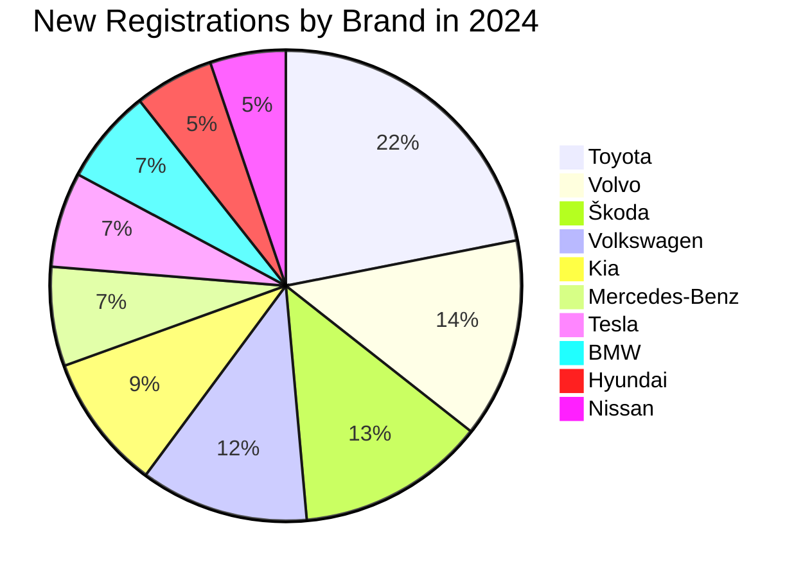

# Test-Repo-for-Home-DIYs


# Finnish Mushrooms
| Mushroom (English / Finnish)               | Scientific Name          | Edibility                                |
|--------------------------------------------|--------------------------|------------------------------------------|
| Chanterelle / Kantarelli                   | *Cantharellus cibarius*  | Edible, choice                           |
| Porcini / Herkkutatti                      | *Boletus edulis*         | Edible, choice                           |
| Funnel Chanterelle / Suppilovahvero        | *Craterellus tubaeformis*| Edible                                   |
| Slippery Jack / Rasvaturvesieni            | *Suillus luteus*         | Edible                                   |
| Saffron Milk Cap / Keltavahvero            | *Lactarius deliciosus*   | Edible                                   |
| Birch Bolete / Lehmustatti                 | *Leccinum scabrum*       | Edible                                   |
| Giant Puffball / Iso lakki                 | *Calvatia gigantea*      | Edible (when young)                      |
| False Morel / Korvasieni                   | *Gyromitra esculenta*    | Poisonous raw; edible after thorough cooking |
| Fly Agaric / Kärpässieni                   | *Amanita muscaria*       | Poisonous (hallucinogenic)               |
| Death Cap                                  | *Amanita phalloides*     | Deadly poisonous                        |


# Vehicle stat in Finland

| Brand             | New Registrations in 2024 |
|-------------------|---------------------------:|
| Toyota            | 12 464                     |
| Volvo             |  7 801                     |
| Škoda             |  7 379                     |
| Volkswagen        |  6 578                     |
| Kia               |  5 316                     |
| Mercedes-Benz     |  3 876                     |
| Tesla             |  3 717                     |
| BMW               |  3 717                     |
| Hyundai           |  3 100                     |
| Nissan            |  2 956                     |


# This is a video for testing 

https://github.com/user-attachments/assets/5eb584f2-d79d-4c5d-98e3-3aa50ed9baf6


# bar chart for test purposes

```mermaid
bar
  title Finnish Mushrooms by Edibility Category
  "Edible, choice": 2
  "Edible": 4
  "Edible (when young)": 1
  "Poisonous raw; edible after cooking": 1
  "Poisonous (hallucinogenic)": 1
  "Deadly poisonous": 1
```

```geojson
{
  "type": "FeatureCollection",
  "features": [
    {
      "type": "Feature",
      "id": 1,
      "properties": {
        "ID": 0
      },
      "geometry": {
        "type": "Polygon",
        "coordinates": [
          [
              [-90,35],
              [-90,30],
              [-85,30],
              [-85,35],
              [-90,35]
          ]
        ]
      }
    }
  ]
}
```

