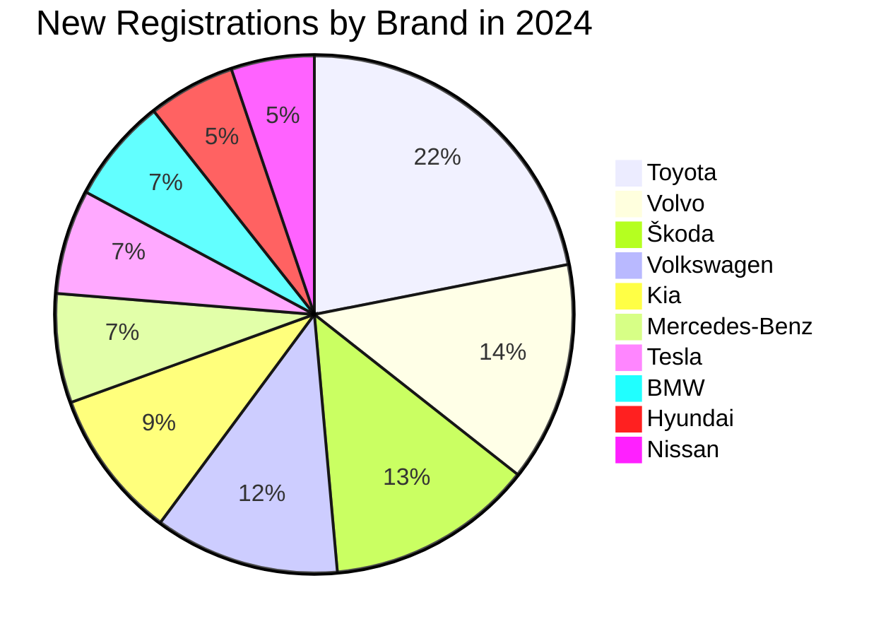

# Test-Repo-for-Home-DIYs

This repo is mainly used to maintain data for my DIY proect such as Robot framework testing, NLP, Web scraping etc


# Finnish Mushrooms
| Mushroom (English / Finnish)               | Scientific Name          | Edibility                                |
|--------------------------------------------|--------------------------|------------------------------------------|
| Chanterelle / Kantarelli                   | *Cantharellus cibarius*  | Edible, choice                           |
| Porcini / Herkkutatti                      | *Boletus edulis*         | Edible, choice                           |
| Funnel Chanterelle / Suppilovahvero        | *Craterellus tubaeformis*| Edible                                   |
| Slippery Jack / Rasvaturvesieni            | *Suillus luteus*         | Edible                                   |
| Saffron Milk Cap / Keltavahvero            | *Lactarius deliciosus*   | Edible                                   |
| Birch Bolete / Lehmustatti                 | *Leccinum scabrum*       | Edible                                   |
| Giant Puffball / Iso lakki                 | *Calvatia gigantea*      | Edible (when young)                      |
| False Morel / Korvasieni                   | *Gyromitra esculenta*    | Poisonous raw; edible after thorough cooking |
| Fly Agaric / Kärpässieni                   | *Amanita muscaria*       | Poisonous (hallucinogenic)               |
| Death Cap                                  | *Amanita phalloides*     | Deadly poisonous                        |


# Vehicle stat in Finland

| Brand             | New Registrations in 2024 |
|-------------------|---------------------------:|
| Toyota            | 12 464                     |
| Volvo             |  7 801                     |
| Škoda             |  7 379                     |
| Volkswagen        |  6 578                     |
| Kia               |  5 316                     |
| Mercedes-Benz     |  3 876                     |
| Tesla             |  3 717                     |
| BMW               |  3 717                     |
| Hyundai           |  3 100                     |
| Nissan            |  2 956                     |


# This is a video for testing 

https://github.com/user-attachments/assets/5eb584f2-d79d-4c5d-98e3-3aa50ed9baf6


# bar chart for test purposes and new tab opening

![Bar Graph][image](https://github.com/user-attachments/assets/0527fbd9-022f-4871-a171-27d25e17fd5b)


# Testing maps


```geojson
{
  "type": "FeatureCollection",
  "features": [
    {
      "type": "Feature",
      "id": 1,
      "properties": {
        "ID": 0
      },
      "geometry": {
        "type": "Polygon",
        "coordinates": [
          [
              [-90,35],
              [-90,30],
              [-85,30],
              [-85,35],
              [-90,35]
          ]
        ]
      }
    }
  ]
}
```

```topojson
{
  "type": "Topology",
  "transform": {
    "scale": [0.0005000500050005, 0.00010001000100010001],
    "translate": [100, 0]
  },
  "objects": {
    "example": {
      "type": "GeometryCollection",
      "geometries": [
        {
          "type": "Point",
          "properties": {"prop0": "value0"},
          "coordinates": [4000, 5000]
        },
        {
          "type": "LineString",
          "properties": {"prop0": "value0", "prop1": 0},
          "arcs": [0]
        },
        {
          "type": "Polygon",
          "properties": {"prop0": "value0",
            "prop1": {"this": "that"}
          },
          "arcs": [[1]]
        }
      ]
    }
  },
  "arcs": [[[4000, 0], [1999, 9999], [2000, -9999], [2000, 9999]],[[0, 0], [0, 9999], [2000, 0], [0, -9999], [-2000, 0]]]
}
```


# Trying test scenarios in large txts

# Finland Travel Guide

A comprehensive guide to the most captivating tourist destinations across Finland. Whether you’re drawn by the buzz of modern cities, the serenity of endless lakes, or the magic of the Arctic, Finland offers something unforgettable for every traveler.

---

## Table of Contents

- [Introduction](#introduction)  
- [Helsinki and Uusimaa](#helsinki-and-uusimaa)  
- [Turku and the Archipelago Coast](#turku-and-the-archipelago-coast)  
- [Porvoo and Historic Towns](#porvoo-and-historic-towns)  
- [Lapland and Rovaniemi](#lapland-and-rovaniemi)  
- [Northern Lights & Midnight Sun](#northern-lights--midnight-sun)  
- [Santa Claus Village & Arctic Adventures](#santa-claus-village--arctic-adventures)  
- [Finnish Lakeland & Lake Saimaa](#finnish-lakeland--lake-saimaa)  
- [National Parks & Wilderness](#national-parks--wilderness)  
- [Åland Islands](#åland-islands)  
- [Finnish Sauna & Wellness Culture](#finnish-sauna--wellness-culture)  
- [Design, Cuisine & Culture](#design-cuisine--culture)  
- [Conclusion](#conclusion)  

---

## Introduction

Finland, the Land of a Thousand Lakes, enchants visitors with its pristine nature, vibrant design scene, and warm-hearted culture. From the bustling capital of Helsinki on the southern coast to remote Arctic wilderness in Lapland, Finland is a study in contrasts: ultra-modern urban hubs coexist alongside ancient forests and serene waterways. Travelers can immerse themselves in world-class museums and Nordic architecture, chase the glow of the Northern Lights, or unwind in traditional lakeside cottages. This guide will take you through Finland’s top tourist destinations, highlighting the unique experiences that make each region special.

---

## Helsinki and Uusimaa

### Exploring the Capital Region  
Helsinki, Finland’s dynamic capital, sits on a rugged peninsula overlooking the Baltic Sea. Its streets blend neoclassical architecture—exemplified by the Senate Square and Helsinki Cathedral—with sleek contemporary design, visible at the Oodi Central Library and the Amos Rex museum.

- **Senate Square & Helsinki Cathedral**: The 19th-century neoclassical heart of the city, framed by government buildings and the iconic green-domed cathedral.  
- **Suomenlinna Sea Fortress**: A UNESCO World Heritage site accessible by a 15-minute ferry; wander its historic ramparts and underground tunnels.  
- **Design District**: A cluster of boutiques, galleries, and studios showcasing Finnish design—a must for fans of Marimekko, Iittala, and Artek.  
- **Market Square & Old Market Hall**: Sample local delicacies like karjalanpiirakka (Karelian pasties) and fresh salmon at vendor stalls.  
- **Esplanadi Park**: Known locally as “Espa,” this tree-lined promenade buzzes with street musicians, cafés, and seasonal events.

Beyond Helsinki, the Uusimaa region offers coastal towns like Porvoo and cultural sites such as the medieval Turku Castle, making day trips easy and rewarding.

---

## Turku and the Archipelago Coast

### Finland’s Oldest City  
Turku, situated on the southwest coast, served as Finland’s capital until 1812. Its medieval castle overlooks the Aura River, where summer evenings come alive with riverside bars and restaurants.

- **Turku Castle** (*Turun linna*): Dating to the late 13th century, this fortress-turned-museum immerses visitors in Finnish medieval history.  
- **Turku Cathedral**: Finland’s national shrine, consecrated in 1300 and featuring Gothic murals and crypts.  
- **Wäinö Aaltonen Museum of Art**: Dedicated to the nation’s sculptor-artist, set in a striking modernist building.

### Archipelago Sea  
From Turku, explore the Archipelago Sea—one of the world’s largest archipelagos with over 20,000 islands. The **Archipelago Trail** (Åbolandsleden) weaves by ferry and bridge, connecting charming islets where you can cycle, kayak, and indulge in farm-to-table seafood.

---

## Porvoo and Historic Towns

### Step Back in Time  
Porvoo, east of Helsinki, captivates with its cobbled streets and pastel wooden houses perched above the Porvoonjoki River. Highlights include:

- **Old Town**: Narrow lanes lined with centuries-old shops, boutiques, and atmospheric cafés.  
- **Porvoo Cathedral**: A crimson brick structure with memorials to Finnish literary giant Johan Ludvig Runeberg.  
- **Brunberg’s Chocolate Shop**: Famous for sweet treats like the *Runeberg torte*, a small almond cake named after Runeberg himself.

Other historic gems in the region include Naantali—home to Moomin World theme park—and charming Fiskars Village, known for its design workshops and artisanal markets.

---

## Lapland and Rovaniemi

### Gateway to the Arctic  
Lapland, Finland’s northernmost region, beckons with snow-capped forests, reindeer herds, and Indigenous Sámi culture. Rovaniemi, the region’s capital, straddles the Arctic Circle and offers:

- **Arktikum Museum & Science Centre**: An immersive look at Arctic life, climate research, and Northern Lights science.  
- **Ounasvaara Ski Resort**: Just outside town, perfect for downhill skiing, snowboarding, and panoramic chairlift rides.  
- **Reindeer Farms & Sámi Experiences**: Learn about reindeer herding traditions, taste *suovas* (smoked reindeer meat), and hear joik singing.

Rovaniemi’s blend of modern amenities and wilderness access makes it the ideal base for exploring deeper into Lapland.

---

## Northern Lights & Midnight Sun

### Celestial Phenomena  
Finland’s location above the Arctic Circle grants two extraordinary natural shows:

1. **Northern Lights (Aurora Borealis)**  
   - Visible from late August through April on clear nights.  
   - Best viewing sites: remote wilderness lodges around Inari, Kakslauttanen, and Kilpisjärvi.

2. **Midnight Sun**  
   - June and early July bring continuous daylight—perfect for hiking, fishing, or midnight golf.  
   - Experience 24-hour daylight at the top of Lapland’s fell ridges or aboard a midnight sun cruise in the archipelago.

Whether you chase the neon-green auroras in winter or bask under the midnight sun in summer, Finland’s Arctic magic is unparalleled.

---

## Santa Claus Village & Arctic Adventures

### Childhood Dreams Come True  
Located 8 km north of Rovaniemi, **Santa Claus Village** is a year-round festive wonderland:

- **Santa’s Office**: Meet Santa himself and receive an official Arctic Circle crossing certificate.  
- **SantaPark**: An underground amusement park with Elf School and gingerbread decorating.  
- **Husky & Reindeer Safaris**: Mush a sled through silent forests by dog team or reindeer sleigh.

For adrenaline seekers, try ice-driving on frozen lakes, snowmobiling under starlit skies, or cross-country skiing across vast, snowy plains.

---

## Finnish Lakeland & Lake Saimaa

### Water Wonderland  
Central and eastern Finland are dominated by interconnected lakes and waterways. The **Finnish Lakeland** boasts:

- **Lake Saimaa**: Finland’s largest lake, fringed by sandy beaches, pine forests, and the UNESCO-protected Olavinlinna Castle in Savonlinna.  
- **Sauna Cruises**: Float along calm waters in a floating sauna boat, then dive into the lake for a refreshing plunge.  
- **Fishing & Wildlife**: Spot the rare Saimaa ringed seal, endemic to these waters, and fish for pike and perch.

Rent a lakeside cottage to experience the quintessential Finnish summer—dawn-til-dusk lake swims, evening bonfires, and starry skies.

---

## National Parks & Wilderness

### Nature Preserves  
Finland’s 40 national parks protect diverse landscapes—from coastal skerries to boreal forests:

- **Nuuksio National Park** (near Helsinki): Day-trip destination for hiking, berry-picking, and canoeing in rugged, glacial terrain.  
- **Koli National Park**: Dramatic ridges overlooking Lake Pielinen inspired Finnish landscape paintings; ideal for panoramic hikes.  
- **Urho Kekkonen National Park** (Inari): Vast wilderness for multi-day treks, wild berry harvesting, and off-grid solitude.  
- **Karhunkierros Trail** (Oulanka NP): One of Finland’s most famous long-distance hikes, traversing rivers, rapids, and old-growth forest.

Whether you seek a short nature walk or a week-long backpacking adventure, Finland’s national parks cater to all levels.

---

## Åland Islands

### Baltic Archipelago Realm  
The autonomy-granted Åland Islands sit between Finland and Sweden, offering:

- **Mariehamn**: The compact capital with maritime museum and red-timbered wooden buildings.  
- **Cycling Trails**: Over 200 km of marked routes weave among rocky islets, seaside meadows, and quaint villages.  
- **Kastelholm Castle**: A medieval fortress with historic exhibits and a riverside location perfect for summer concerts.  
- **Sea Kayaking & Sailing**: Explore hidden coves and traditional boathouses under pastel-hued skies.

Åland’s Swedish-speaking culture, gentle pace, and scenic beauty make it a cherished escape.

---

## Finnish Sauna & Wellness Culture

### More Than a Steam Room  
Sauna is woven into Finland’s national identity—with over two million saunas for a population of 5.5 million. Key insights:

- **Types of Sauna**: Traditional wood-burning, electric, smoke sauna (*savusauna*), and mobile saunas.  
- **Ritual**: Alternate hot sauna sessions with cold plunges—lake, sea, or ice hole—for circulation and invigoration.  
- **Wellness Retreats**: Spa hotels in Lapland and along the Lakeland offer sauna, spa treatments, and mother nature therapy.

Participating in a sauna ritual is both cleansing and communal—a timeless Finnish practice.

---

## Design, Cuisine & Culture

### Nordic Excellence  
Finland’s creative spirit and culinary traditions elevate any journey:

- **Architecture & Design**: From Alvar Aalto’s iconic buildings to contemporary marvels like Helsinki’s Oodi Library, Finnish design marries form and function.  
- **Museums & Art**: Kiasma (modern art), Ateneum (classical art), and the Tampere Art Museum showcase national and international works.  
- **Culinary Delights**:  
  - **Rye Bread & Karelian Pies**: Staple grains and butter-egg fillings.  
  - **Local Berries & Mushrooms**: Wild blueberries, lingonberries, chanterelles—featured in jams, desserts, and sauces.  
  - **Nordic Fine Dining**: Michelin-starred restaurants like Olo (Helsinki) highlight seasonal, foraged ingredients.

Seasonal festivals—Midsummer bonfires, Kaamos (polar night) events, and winter ice swimming competitions—offer immersive cultural experiences year-round.

---

## Conclusion

Finland’s allure lies in its harmonious blend of modern sophistication and unspoiled wilderness. Whether you’re soaking in a lakeside sauna, marveling at contemporary design in Helsinki, or gazing at the Northern Lights in Lapland, each moment reveals the Finnish ethos of *sisu*—grit, resilience, and deep appreciation for nature. Pack your warmest layers for winter adventures and your hiking boots for summer treks; Finland’s diverse landscapes and vibrant culture promise memories that will last a lifetime.

---

*Safe travels and tervetuloa Suomeen!*  


